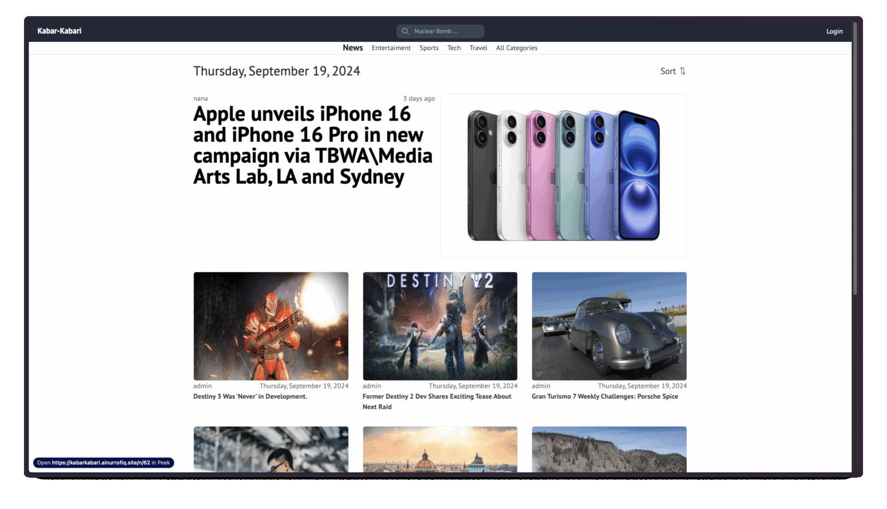

# kabar-kabari

News Portal Apps

## About

This is a single-page application built with React for the frontend, Express for the backend, and PostgreSQL for the database. The application serves as a news portal where users can explore news from various categories, search for specific news, view the latest news, and get detailed information about each news item.

## Demo

[Demo Link](https://kabarkabari.ainurrofiq.site)

## Features

-   **News Categories**: Browse news articles based on different categories.
-   **Search**: Search for news articles using keywords.
-   **Latest News**: View the most recent news articles.
-   **News Details**: Get detailed information about each news article.
-   **User Authentication**: Users can log in to the application.
-   **CRUD Operations**: Logged-in users can post, edit, and delete news articles they have created.
-   **Admin Control**: Only admins can create user accounts.

## Tech Stack

-   **Frontend:** React, Redux, Axios, Tailwind CSS
-   **Backend:** Express JS, bcrypt, Cloudinary, Multer, Sequelize, Jest
-   **Database:** PostgreSQL

## Deployment

-   **Frontend**: Deployed on Firebase.
-   **Backend**: Deployed on Railway.
-   **Database**: Deployed on Railway.

## Repositories

-   **Frontend Repository**: [kabarKabari-Client-React](https://github.com/MuhammadAinurR/kabarKabari-Client-React)
-   **Backend Repository**: [kabarKabari-Server-Express](https://github.com/MuhammadAinurR/kabarKabari-Server-Express)
